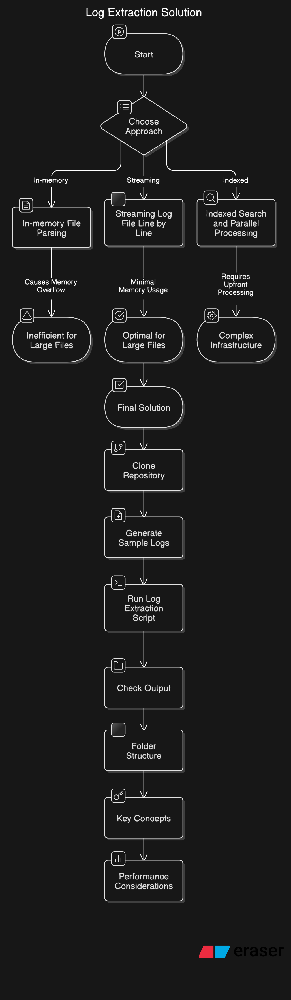

## Solutions Considered

During the process of designing the log extraction solution, I considered several approaches to efficiently handle log file extraction for large files, such as those over 1 TB in size. Below are the approaches I explored:

1. **In-memory File Parsing**:

   - The first approach considered was reading the entire log file into memory, parsing the log entries, and filtering by the target date. While this is a simple and direct approach, it is highly inefficient for large files, especially those of size 1 TB, as it could easily cause memory overflow and poor performance.

2. **Streaming Log File Line by Line**:

   - The second approach focused on streaming the log file line by line, which would prevent the system from loading the entire file into memory. This approach leverages Node.js streams and the `readline` module, which allows us to process logs one line at a time. This is an optimal approach for large files, as it minimizes memory consumption while processing the log entries.

3. **Indexed Search and Parallel Processing**:
   - As a more advanced solution, I considered implementing a system where log files are pre-indexed by date. This would involve creating a separate index that stores the locations of logs by date, allowing for faster retrieval. This approach, while efficient, would require significant upfront processing and more complex infrastructure. Since the problem specifically asked for efficient log extraction, I opted for the line-by-line streaming approach instead, as it is simpler and sufficient for this task.

### Final Solution Summary

After considering the approaches listed above, I chose the **streaming log file line by line** solution using Node.js streams and the `readline` module. This method ensures that:

- Memory consumption is minimal, as we never load the entire log file into memory.
- Performance is optimized by processing logs only when necessary, filtering by date, and writing them directly to an output file.
- The solution is simple and scalable, capable of handling large log files efficiently.

I implemented the solution as follows:

- The script reads the log file line by line.
- Each line is checked against a regular expression that matches the specified date format and log level (`INFO`, `WARN`, or `ERROR`).
- Matching lines are written to a separate output file corresponding to the target date.

### Steps to Run

To run this solution, follow the steps below:

1. **Clone the repository**:
   First, clone the repository to your local machine if you haven’t already:

   ```bash
   git clone <repository-url>
   cd <repository-directory>
   ```

2. **Generate Sample Logs** (if needed):
   If you want to test the extraction functionality with a sample log file, run the following script to generate a log file:

   ```bash
   node generate_sample_logs.js
   ```

   This will create a `sample_logs.log` file in your project directory with 100,000 random log entries.

3. **Run the Log Extraction Script**:
   Once you have the log file ready, run the `extract_logs.js` script by passing the target date (in `YYYY-MM-DD` format) as an argument. For example, to extract logs for `2024-04-04`, run:

   ```bash
   node extract_logs.js 2024-04-04
   ```

   The script will read through the `logs_2024.log` file (or `sample_logs.log` for testing purposes) and filter out all log entries that match the specified date. The filtered logs will be saved in an output file named `output_YYYY-MM-DD.txt` inside the `output/` directory.

4. **Check the Output**:
   Once the script finishes, check the `output` folder for the resulting log file:
   ```bash
   output/output_2024-04-04.txt
   ```

### Folder Structure

```
├── generate_sample_logs.js      # Script to generate a sample log file
├── extract_logs.js              # Main log extraction script
├── sample_logs.log              # Sample log file (optional, generated by generate_sample_logs.js)
└── output                       # Output directory for extracted logs
    └── output_YYYY-MM-DD.txt    # Extracted log file for the given date
```

### Key Concepts

- **Node.js Streams**: Used for efficiently reading large files without loading them entirely into memory.
- **Regular Expressions**: Used to filter logs based on the target date and log level.
- **Write Streams**: Used to write the filtered logs to an output file.

### Performance Considerations

- This solution efficiently handles large log files by processing them line by line, keeping memory usage low and ensuring good performance.
- The time complexity for this approach is O(n), where `n` is the number of lines in the log file, as we process each line once.



### Developed By

- Sushant Dey (2K21/MC/164)
- MATHEMATICS AND COMPUTING
